# Hydra Evaluator




Fast A/B judging for Project Hydra image-edit tasks.

Drop in the prompt, load the input image and two candidate edits, score the five
rating axes, and copy a clean submission-ready justification. Manual when you
want control. Claude when you want a fast second set of eyes.

## What it does

- Pulls prompts and image links out of pasted Hydra task text when it can.
- Shows Input, Response A, and Response B side by side for direct comparison.
- Builds a checklist from the prompt so missed instructions are harder to miss.
- Tracks the standard five A-vs-B rating axes.
- Turns quick notes into a clean 2-5 sentence justification.
- Optionally asks Claude to evaluate the images and prefill the ratings.

## The workflow

1. Paste the full task text or just the edit prompt.
2. Click `Pull prompt and links`, or paste/drop images into the three slots.
3. Use `Make checklist` to break the prompt into concrete requirements.
4. Score the five rating rows.
5. Add fast notes about the stronger image, weaker image, and tradeoffs.
6. Click `Draft`, review the justification, then `Copy`.

## Auto-evaluate mode

The Claude button sends the prompt and images to Anthropic's Messages API with a
strict JSON response shape. The result maps back into the rating buttons, note
fields, and justification box so you can review before submitting.

Available model choices in the app:

| Model | Use it when |
|---|---|
| `claude-opus-4-8` | You want the sharpest image-edit judgment and can spend more per task |
| `claude-haiku-4-5` | You want a cheaper first-pass draft to edit yourself |

The grading rule is simple: a good edit makes the requested change and preserves
everything else. If a response regenerates the scene, it failed the job.

## Run it

No install. No bundler. No build step.

```powershell
cd "C:\Users\enter\OneDrive\Desktop\Project Hydra\hydra-evaluator-app"
python -m http.server 8765 --bind 127.0.0.1
```

Open:

```text
http://127.0.0.1:8765/index.html
```

You can also open `index.html` directly, but serving the folder through
localhost is more reliable when working with local image files.

## Desktop launcher

Windows launcher scripts are included:

| Script | What it does |
|---|---|
| `scripts/start-hydra-evaluator.ps1` | Starts a local Python static server on port `8765` and opens the app |
| `scripts/install-desktop-icon.ps1` | Creates a `Hydra Evaluator` shortcut on your Desktop with the Hydra icon |

Run the installer once:

```powershell
.\scripts\install-desktop-icon.ps1
```

After that, double-click `Hydra Evaluator` from the Desktop.

## Repo map

```text
index.html       App shell and form layout
styles.css       Visual system, responsive grid, cards, buttons, image panels
app.js           Parsing, image loading, ratings, justification drafting, Claude call
assets/          Hydra banner and Windows icon source
scripts/         Windows launcher and Desktop shortcut installer
.github/         CI syntax check for app.js
```

## API key safety

The Anthropic API key is entered at runtime and stored only in this browser's
`localStorage`. It is sent directly to Anthropic with the
`anthropic-dangerous-direct-browser-access` header.

Do not host this app publicly as-is. If this becomes a hosted app, put a small
server-side proxy in front so the key never sits in someone else's browser.

## Check it

```powershell
node --check app.js
```

That is the same syntax check used by CI.
