<p align="center">
  
</p>

<p align="center">
  <strong>Browser tool for image-edit model evaluation, with optional Claude auto-grading.</strong>
</p>

<p align="center">
  <a href="https://github.com/DaCameraGirl/hydra-evaluator-app"></a>
  <a href="https://github.com/DaCameraGirl/AI-Video-Annotator"></a>
</p>

<p align="center">
  
  
</p>

### Languages

<p align="center">
  
  
  
</p>

### Stack

<p align="center">
  
  
</p>

<p align="center">
  Built by <strong>Angela Hudson</strong> · <a href="https://github.com/DaCameraGirl">DaCameraGirl</a>
</p>
# Hydra Evaluator

Local Project Hydra image-response evaluation helper. Paste a Hydra task, load the input and Response A/B images, choose ratings, and draft a concise justification in Angela's preferred comparison style.

**Live:** https://dacameragirl.github.io/hydra-evaluator-app/

Built by Angela Hudson / DaCameraGirl.

<p align="center"></p>
<p align="center"></p>


- **Prompt parsing**: paste the full task text and pull out the prompt plus storage image links when possible.
- **Side-by-side image review**: view the input, Response A, and Response B together with URL or file-drop loading.
- **Prompt checklist**: split the prompt into concrete details to watch for while rating.
- **Hydra ratings**: record overall preference, instruction following, correctness, visual quality, and naturalness.
- **Justification drafting**: generate 2 to 5 sentence explanations that start with `Response A/B is better than Response A/B.`
- **No em dashes**: generated text replaces em dashes so it matches Angela's requested style.

<p align="center"></p>
<p align="center"></p>


This app does not automatically judge image quality yet. It is a fast local workbench for careful human review. Treat it as a helper for:

- preserving the original subject, pose, background, and requested invariants
- separating instruction following from correctness
- calling out extra unwanted objects or changed scene details
- writing specific, plain-language justifications under time pressure

<p align="center"></p>
<p align="center"></p>


- React 19 + TypeScript + Vite
- Tailwind CSS v4
- Local browser state only
- GitHub Pages deployment

No backend, no database, no API keys.

<p align="center"></p>
<p align="center"></p>


```bash
npm install
npm run dev
```

Checks:

```bash
npm run lint
npm run typecheck
npm run build
```

<p align="center"></p>
<p align="center"></p>


Pull requests and pushes to `main` run:

- `npm run lint`
- `npm run typecheck`
- `npm run build`

The repo is configured for GitHub Pages at:

```text
https://dacameragirl.github.io/hydra-evaluator-app/
```

The Vite `base` is `/hydra-evaluator-app/` to match the repository name.

Pushing to `main` triggers `.github/workflows/deploy-pages.yml`, which builds the app and publishes `dist/` to GitHub Pages.

<p align="center"></p>
<p align="center"></p>


- Work on feature branches.
- Run lint, typecheck, and build before opening PRs.
- Keep Hydra wording plain and specific.
- Keep generated justifications free of em dashes.
- Use issues for follow-up automation, vision-model support, and rating workflow improvements.

<p align="center"></p>
<p align="center"></p>


Copyright (c) 2026 Angela Hudson. All Rights Reserved. See [LICENSE](LICENSE).
Viewing this repository does not grant a license to use the code.